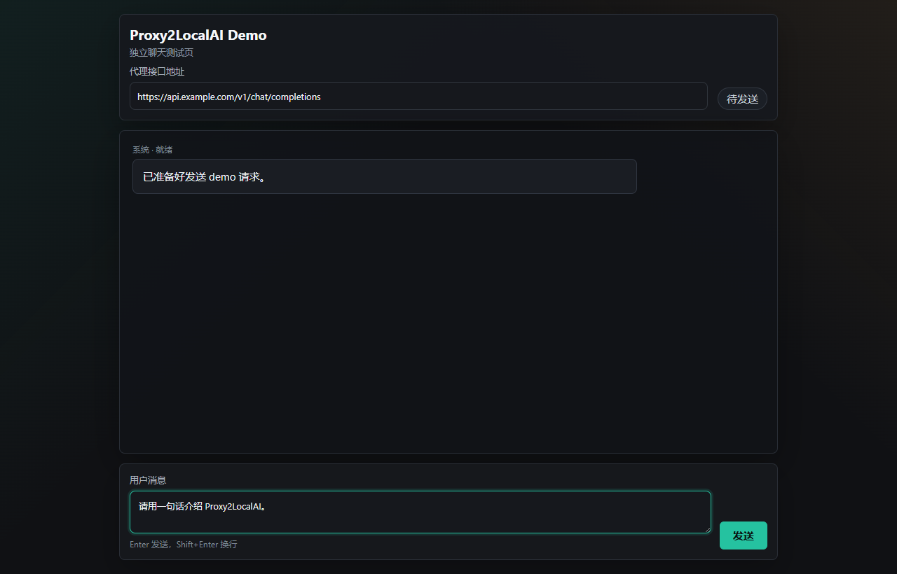
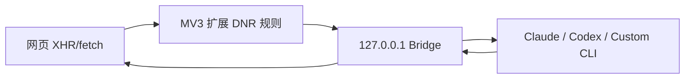

# Proxy2LocalAI

Proxy2LocalAI 是一个 Chrome/Edge MV3 浏览器扩展与本地 Bridge 服务的组合，用来把你明确配置的线上 API 请求代理到本机 AI CLI，例如 Claude Code、Codex 或自定义命令。

它适合调试“原本调用远程大模型 API 的网页或应用”，把指定接口临时接到本机 AI 工具上；它不是全局代理，也不会做 HTTPS MITM。



## 功能亮点

- 只代理启用 profile 中声明的目标域名、路径和 HTTP 方法。
- 支持 OpenAI 兼容普通 JSON、流式 SSE、自定义 JSON 模板和 SSE 事件映射。
- 支持 Claude Code、Codex 和 Custom Provider。
- 支持按 profile 启用多轮上下文记忆，并可用正则从接口参数中提取指定上下文。
- 支持配置导入、备份和分享模板（导出模板自动移除 token、本地路径和测试结果）。
- 新用户上手向导：自动检测 Bridge 状态、从 cURL 创建配置、选择 AI 工具和返回格式。
- 配置分层展示：基础配置、高级配置、专家配置三个折叠区域，降低新用户认知负担。
- 内置 4 种响应格式模板（OpenAI Chat JSON、OpenAI SSE、业务 JSON、通用 SSE 映射），支持从响应样例自动推断最佳模板。
- 最近 20 条请求诊断：记录请求从接收到完成的全阶段，失败可归因到明确阶段（如 `provider_no_output`）。
- Provider 实际测试：发送最小 prompt 验证 AI 工具是否能正常工作。
- Bridge 与扩展版本兼容检查，协议版本不匹配时提示升级。
- Bridge 自检可以定位 Node、配置目录、日志目录和 Provider 命令。
- 默认只监听 `127.0.0.1`，管理接口和代理入口都需要本地 token。

## 适用场景

- 本地调试依赖 OpenAI 兼容接口的网页、插件或前端 demo。
- 把某个测试环境 API 临时接到 Claude Code、Codex 或自定义 CLI。
- 对比真实接口和本机 AI CLI 的响应格式。
- 制作可分享的接口代理模板，让其他人导入后填写自己的本机路径。

## 不适用场景

- 浏览器全局代理。
- 抓包或解密 HTTPS 流量。
- 代理未明确配置的所有请求。
- 在不可信项目目录中开启无人值守本机命令执行。

## 架构



- `apps/extension`：浏览器扩展，负责配置界面、可选域名权限、动态重定向规则、Popup 和 Options 页面。
- `apps/bridge`：本地 HTTP 服务，负责鉴权、CORS、请求上下文组装、调用本机 AI CLI，并返回兼容响应。
- `packages/shared`：共享配置模型、配置导入导出、提示词拼装和响应模板工具。

请求上下文会被拼成：

```text
<parames>{接口参数 JSON}</parames>{可选提示词}
```

## 快速开始

开发模式：

```powershell
npm install
npm run build
npm run start:bridge
```

也可以使用跨平台启动脚本：

```powershell
.\scripts\start-bridge.ps1
```

```bash
sh scripts/start-bridge.sh
```

然后在 Chrome 或 Edge 中打开扩展管理页，启用开发者模式，加载目录：

```text
apps/extension/dist
```

默认 Bridge 地址：

```text
http://127.0.0.1:39399
```

默认本地 token：

```text
proxy2localai-local-token
```

默认 token 方便本机快速体验。长期使用建议设置随机 token：

```powershell
$env:PROXY2LOCALAI_TOKEN="your-random-local-token"
npm run start:bridge
```

## Demo 聊天测试页

项目内置一个单 HTML 聊天测试页：

```text
demo/index.html
```

使用前请先在扩展配置页创建并同步一套启用 profile：

- 目标地址：`https://api.example.com`
- 目标接口：`/v1/chat/completions`
- HTTP 方法：`POST`

打开 demo 页面后输入消息并点击 `发送`。如果扩展规则命中，请求会被代理到本地 Bridge，返回内容会显示在聊天窗口中。

## 普通用户安装

Release 会包含两个文件（文件名带版本号）：

- `proxy2localai-extension-0.1.0.zip`：解压后在 Chrome/Edge 扩展管理页加载。
- `proxy2localai-bridge-0.1.0.zip`：解压后按系统运行 `start.cmd`、`start.ps1` 或 `start.sh`。

Bridge 包里也包含 `doctor.mjs`、`doctor.cmd`、`doctor.ps1` 和 `doctor.sh`，用于定位 Node、配置、数据目录和 Claude/Codex 命令是否可用。

## 配置导入导出

扩展配置页支持三类文件操作：

- `导入配置`：导入 `.json` 配置文件，支持新版 Proxy2LocalAI 配置文件和旧版 `AppConfig` JSON。
- `导出备份`：保留本机 token、Bridge 地址和 profile，用于同一用户自己的备份迁移。
- `导出模板`：移除 token，把 profile 停用，并把本机项目目录替换成占位提示，适合分享给其他人。

导出的配置文件格式示例：

```json
{
  "app": "Proxy2LocalAI",
  "schemaVersion": 1,
  "mode": "backup",
  "exportedAt": "2026-05-21T08:00:00.000Z",
  "config": {
    "bridgeBaseUrl": "http://127.0.0.1:39399",
    "token": "proxy2localai-local-token",
    "profiles": []
  }
}
```

## Bridge 自检

扩展配置页可以点击 `自检 Bridge`。命令行也可以运行：

```powershell
npm run doctor
```

或直接请求接口：

```powershell
Invoke-RestMethod `
  -Headers @{ "x-proxy2localai-token" = "proxy2localai-local-token" } `
  http://127.0.0.1:39399/doctor
```

自检会检查：

- Bridge 是否响应。
- 是否仍在使用默认 token。
- 当前加载了多少套代理配置。
- 配置和日志目录是否可写。
- 已启用 profile 需要的 `claude`、`codex` 或自定义命令是否能在 PATH 中找到。

自检不会真正调用 Claude/Codex，也不会消耗模型额度。

## 新用户上手向导

当还没有任何代理配置时，点击扩展配置页的 `新增` 按钮会进入创建向导。向导包含 6 个步骤：

1. **检查 Bridge**：自动检测 Bridge 是否在线，离线时显示启动命令。
2. **粘贴 cURL**：从浏览器开发者工具复制目标 API 请求的 cURL，自动提取 URL、方法和请求头。
3. **选择 AI 工具**：默认 Claude Code，也可选 Codex。
4. **选择项目路径**：AI 工具的工作目录。
5. **选择返回格式**：默认 OpenAI SSE（流式），也支持普通 JSON、映射 SSE 和自定义 JSON。
6. **完成**：可执行一次代理测试验证配置是否可用，然后保存。

向导创建的配置默认标记为 `wizard` 模式，配置编辑器只展开基础配置区域，降低复杂度。后续可随时切换到 `advanced` 模式编辑全部字段。

## 配置分层展示

扩展配置页的编辑器将字段分为三层折叠区域：

- **基础配置**：名称、启用、目标地址、HTTP 方法、AI Provider、返回格式、项目路径、提示词。
- **高级配置**：最高权限 CLI、多轮上下文、超时、请求体上限、上下文正则。
- **专家配置**：Provider 追加参数、Custom 命令、自定义 JSON 模板、SSE 事件映射。

向导模式默认只展开基础配置，高级模式展开基础和高级配置，专家配置始终需要手动展开。

## 内置响应格式模板

扩展配置页提供 4 种预设返回格式模板，选择后自动填充对应的返回模式和字段：

| 模板 | 返回模式 | 说明 |
|------|---------|------|
| OpenAI Chat JSON | `block` | 等待完整响应后返回 OpenAI 兼容 JSON |
| OpenAI SSE | `stream` | 逐字流式返回 OpenAI 兼容 SSE 事件 |
| 业务 JSON（code/data/message） | `custom_json` | 包装 AI 数据到业务 JSON 结构 |
| 通用 SSE 映射 | `mapped_sse` | 映射 provider 事件到自定义 SSE 事件流 |

选择模板后可在专家配置中进一步自定义。模板只做预填，不锁死用户编辑。

### 从响应样例推断模板

如果目标 API 已有真实响应，可以在模板选择器中粘贴响应样例，系统会自动推断：

- 包含 `event:` / `data:` 行 -> 映射 SSE 模式，自动提取事件名生成映射。
- 包含 `code`/`data`/`message` 字段的 JSON -> 自定义 JSON 模式，自动生成带 `<aiData/>` 占位符的模板。
- 其他 JSON 或纯文本 -> 普通 JSON 模式。

## 请求诊断

Bridge 在内存中保留最近 20 条代理请求的诊断记录，每条记录包含从请求接收到完成的全阶段：

1. `request_received` — 请求到达
2. `profile_matched` — 匹配到代理配置
3. `provider_spawn` — Provider 启动
4. `provider_done` — Provider 完成（含耗时）
5. `response_done` — 响应发送完成

失败请求会记录错误阶段（如 `provider_no_output`、`provider_error`），方便快速定位原因。

扩展配置页的 `最近请求` 面板展示请求列表，点击可查看详情。支持一键复制诊断信息（已自动脱敏，移除 token、authorization 和 cookie 等敏感字段）。

### Provider 测试

在代理配置编辑器中可以点击 `实际测试` 按钮，Bridge 会向对应 Provider 发送最小 prompt（`"ping"`）验证其是否能正常工作。注意：实际测试会消耗模型额度。

## Bridge 版本兼容

Bridge `/health` 端点返回版本号和协议版本：

```json
{
  "ok": true,
  "service": "proxy2localai-bridge",
  "version": "0.1.0",
  "protocolVersion": 1,
  "profileCount": 2
}
```

扩展配置页和 Popup 会显示 Bridge 版本。如果未来协议版本不匹配，会提示升级 Bridge 或扩展。

## Provider 行为

- Claude Code：默认执行 `claude -p --output-format json --tools ""`；流式模式使用 `stream-json`、`--verbose` 和 `--include-partial-messages`。
- Codex：默认执行 `codex exec --skip-git-repo-check --json -C <projectDir> -`。
- Custom：执行用户配置的命令和参数，把提示词写入 stdin，stdout 作为 AI 输出。

Claude Code 和 Codex 都支持在扩展配置页填写 `AI 工具追加参数`，每行一个参数，Bridge 会追加到默认命令后。默认不会启用 Claude `--dangerously-skip-permissions` 或 Codex `--full-auto`。如果你明确需要无人值守自动化，并且理解本机项目目录风险，可以在扩展配置页为单个 profile 勾选 `最高权限执行本机 CLI`，也可以在追加参数中显式填写对应参数，或设置全局环境变量。勾选最高权限后，Claude 会同时使用 `--dangerously-skip-permissions` 和 `--permission-mode bypassPermissions`。

```powershell
$env:PROXY2LOCALAI_ALLOW_DANGEROUS_CLI="true"
```

## 上下文提取与多轮对话

默认情况下，Bridge 会把页面、目标接口、请求头、查询参数和请求体整体拼入 `<parames>...</parames>`。如果拦截接口参数很多，可以在 profile 中填写 `接口参数上下文正则`，Bridge 会对这份 JSON 参数执行正则匹配；存在捕获组时使用第一个捕获组，否则使用完整匹配结果。留空则保持完整参数。

勾选 `启用多轮上下文记忆` 后，Bridge 会按 `profile + 页面 URL` 在内存中保留最近 10 轮问答，并在下一次请求的 prompt 中追加 `<history>...</history>`。该记忆随 Bridge 进程重启清空，不会写入磁盘。

## 数据目录和环境变量

默认数据目录：

- Windows：`%APPDATA%\Proxy2LocalAI`
- macOS：`~/Library/Application Support/Proxy2LocalAI`
- Linux：`~/.config/proxy2localai`

常用环境变量：

```powershell
$env:PROXY2LOCALAI_TOKEN="your-local-token"
$env:PROXY2LOCALAI_PORT="39399"
$env:PROXY2LOCALAI_DATA_DIR="C:/Users/me/AppData/Roaming/Proxy2LocalAI"
npm run start:bridge
```

也可以精确指定文件：

```powershell
$env:PROXY2LOCALAI_PROFILES_PATH="C:/path/to/profiles.json"
$env:PROXY2LOCALAI_REQUESTS_LOG_PATH="C:/path/to/requests.log"
npm run start:bridge
```

旧版 `web2LocalAgent_*` 环境变量仍兼容，但新配置建议使用 `PROXY2LOCALAI_*`。

## 常用命令

```powershell
npm test
npm run typecheck
npm run build
npm run dev:bridge
npm run dev:extension
npm run doctor
```

## 安全与隐私

请先阅读：

- [安全模型](docs/security-model.md)
- [安全策略](SECURITY.md)
- [隐私说明](PRIVACY.md)

关键边界：

- Bridge 只监听 `127.0.0.1`。
- 扩展只为启用的指定 API 生成动态规则。
- 代理入口通过本地 token 鉴权。
- 扩展产物不依赖远程托管代码。
- 分享模板默认停用 profile，并移除 token。
- Custom Provider 会执行本机命令，只应配置可信命令。

## 排障

如果请求已经被重定向但代理后的请求没有返回，参考 [代理无响应定位清单](docs/proxy-diagnostics.md)。

优先检查：

```powershell
Invoke-RestMethod http://127.0.0.1:39399/health
npm run doctor
```

如果 `profileCount` 是 `0`，说明浏览器里可能有 DNR 规则，但 Bridge 尚未同步 profile。打开扩展配置页点击 `同步` 即可。

### 通过诊断 API 排查

Bridge 提供三个诊断接口（需要 token 鉴权）：

```powershell
# 查看最近 20 条请求摘要
Invoke-RestMethod -Headers @{ "x-proxy2localai-token" = "proxy2localai-local-token" } `
  http://127.0.0.1:39399/diagnostics/recent

# 查看单条请求的完整阶段详情（用上面返回的 id）
Invoke-RestMethod -Headers @{ "x-proxy2localai-token" = "proxy2localai-local-token" } `
  http://127.0.0.1:39399/diagnostics/recent/{requestId}

# 获取脱敏后的诊断文本（可安全分享）
Invoke-RestMethod -Headers @{ "x-proxy2localai-token" = "proxy2localai-local-token" } `
  http://127.0.0.1:39399/diagnostics/recent/{requestId}/export
```

### 通过 Bridge 测试接口验证

```powershell
# 测试完整代理流程
Invoke-RestMethod -Method POST -Headers @{
  "x-proxy2localai-token" = "proxy2localai-local-token"
  "content-type" = "application/json"
} -Body '{"sample":{"body":{"messages":[{"role":"user","content":"ping"}]}}}' `
  http://127.0.0.1:39399/admin/test-profile/{profileId}

# 测试 Provider 是否能正常工作
Invoke-RestMethod -Method POST -Headers @{
  "x-proxy2localai-token" = "proxy2localai-local-token"
} `
  http://127.0.0.1:39399/admin/test-provider/{profileId}
```

## 贡献

欢迎 issue 和 PR。开始前请阅读：

- [贡献指南](CONTRIBUTING.md)
- [社区行为准则](CODE_OF_CONDUCT.md)
- [变更日志](CHANGELOG.md)

提交 PR 前建议运行：

```powershell
npm test
npm run typecheck
npm run build
```

## 已知限制

- 当前只支持指定 API 代理，不做浏览器全局代理或 HTTPS MITM。
- Bridge 仍需要本机 Node.js；后续可以升级为单文件可执行程序或 Native Messaging 主机。
- 浏览器扩展不能读取文件夹真实绝对路径，项目路径仍需要用户手动填写或从模板导入后修正。
