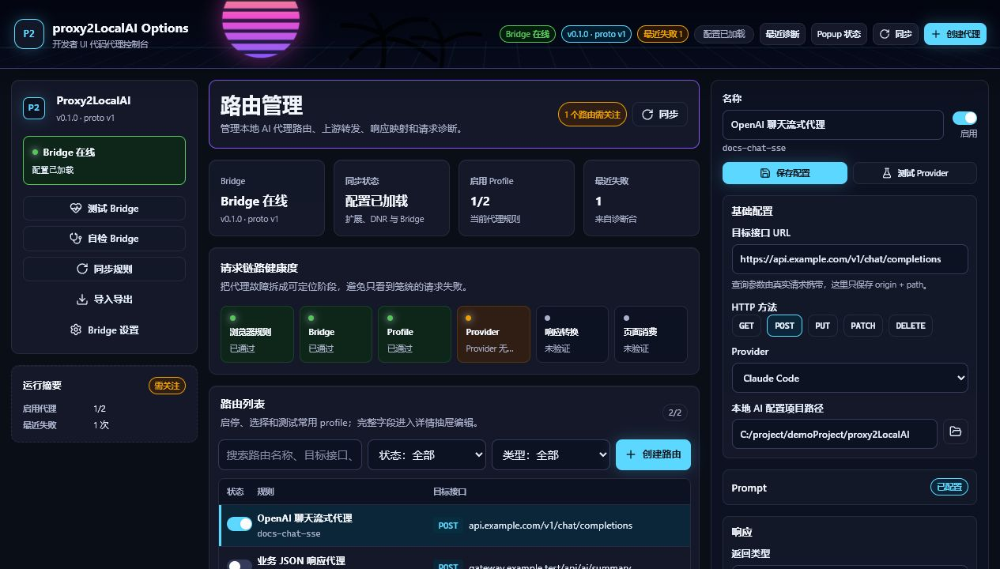
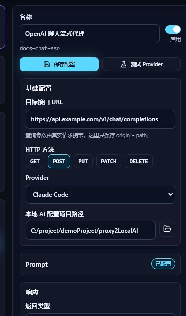
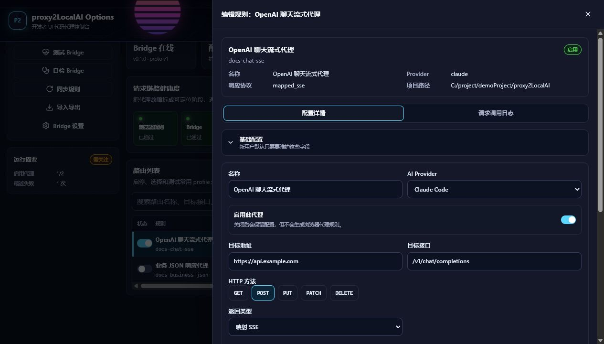
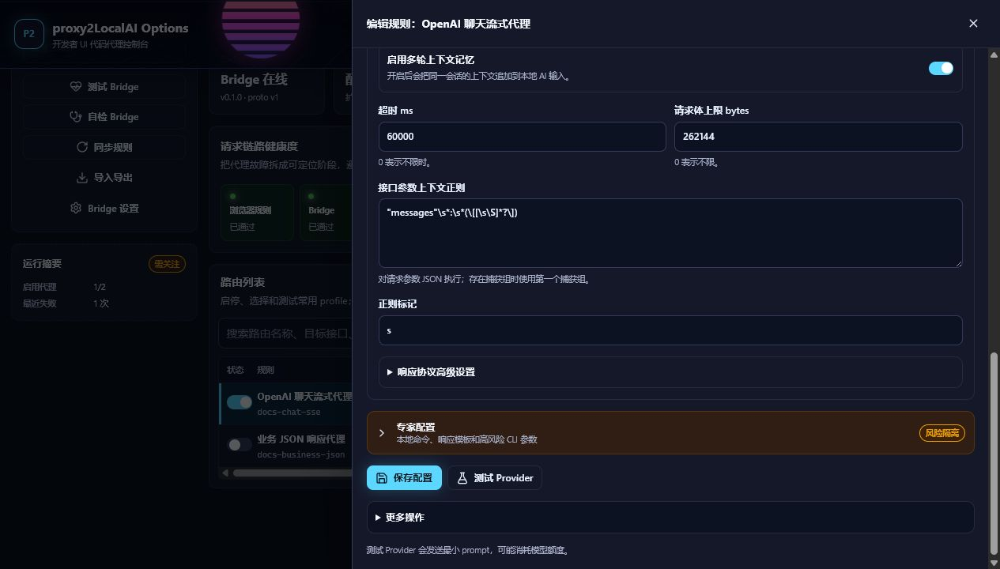
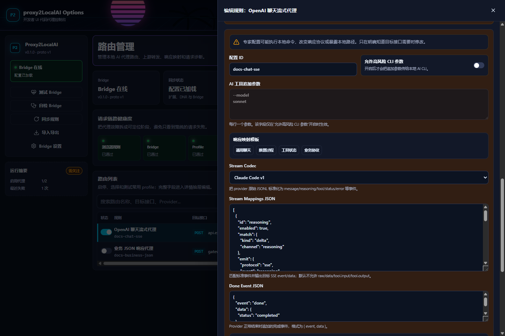
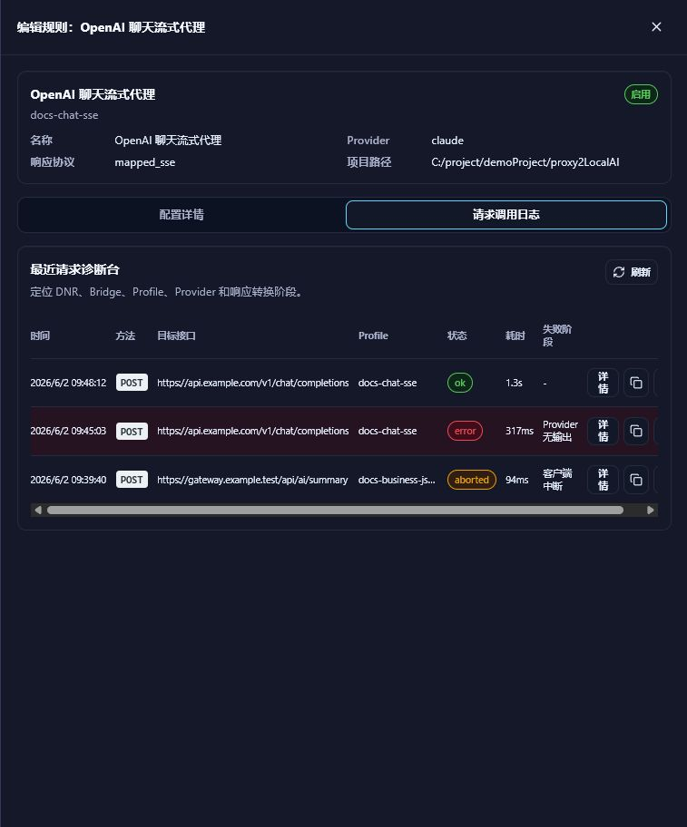
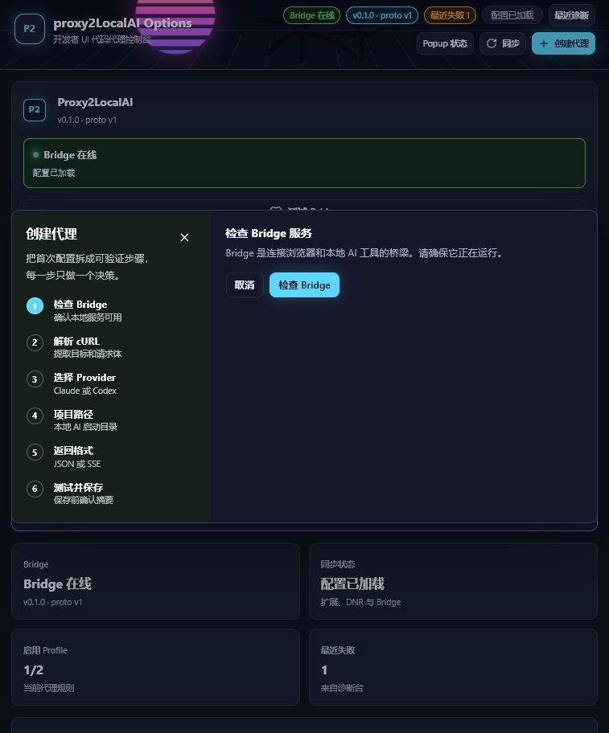
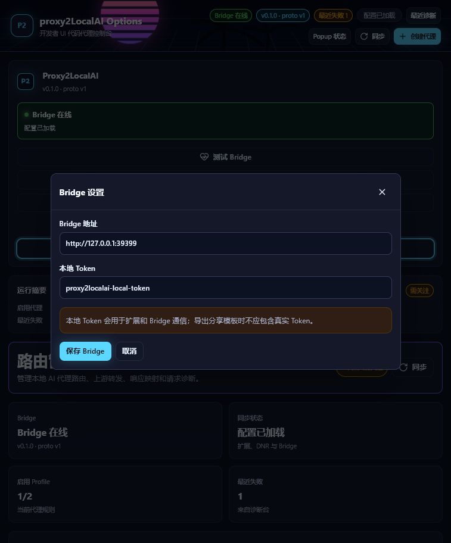
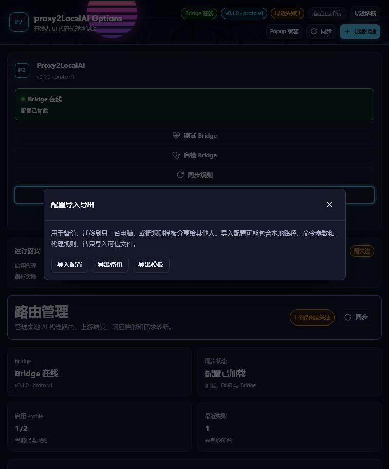
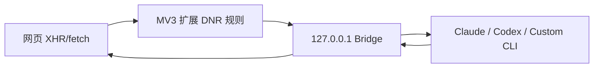

# Proxy2LocalAI

Proxy2LocalAI 是一个 Chrome/Edge MV3 浏览器扩展与本地 Bridge 服务的组合，用来把用户明确配置的浏览器 API 请求代理到本机 AI CLI，例如 Claude Code、Codex CLI 或自定义命令。

它适合调试“原本调用远程大模型 API 的网页或应用”，把指定接口临时接到本机 AI 工具上；它不是浏览器全局代理，也不会做 HTTPS MITM。


## 配置界面截图

### 控制台总览

展示 Bridge 状态、同步状态、启用 profile 数量、请求链路健康度、最近失败数和当前代理规则。



### 侧边日常配置

常用字段放在右侧常驻侧边栏：名称、启用状态、目标接口、HTTP 方法、Provider、项目路径、Prompt 和返回类型。



### 代理配置详情

完整 Profile 字段集中在详情抽屉中，支持基础配置、返回模板、高级配置、专家配置和 Provider 测试。



### 响应协议高级设置

高级配置中可以选择消息返回结构，并配置上下文正则、多轮记忆、超时和请求体上限。



### 映射 SSE 专家配置

`mapped_sse` 支持 Stream Codec、标准化流事件映射、Done Event、工具事件策略和映射安全策略。



### 最近请求诊断台

诊断台展示最近请求、状态、耗时、失败阶段，并支持查看详情、复制脱敏诊断和重试测试。



### 创建代理向导

新用户可以按“检查 Bridge -> 粘贴 cURL -> 选择 Provider -> 项目路径 -> 返回格式 -> 测试并保存”的步骤创建第一条代理。



### Bridge 设置

Bridge 地址和本地 token 独立管理，方便在不同机器、不同端口或发布包环境下迁移。



### 配置导入导出

支持导入配置、导出本机备份和导出分享模板；分享模板会移除真实 token，并停用 profile。



## 功能亮点

- 只代理启用 profile 中声明的目标域名、路径和 HTTP 方法。
- 支持 OpenAI 兼容普通 JSON、OpenAI SSE、自定义 JSON 模板和映射 SSE。
- 支持 Anthropic Messages、OpenAI Chat Completions、OpenAI Responses API 和 Gemini generateContent 的消息结构转换。
- 支持 Claude Code、Codex CLI 和 Custom Provider。
- 支持按 profile 启用多轮上下文记忆，并可用正则从接口参数中提取指定上下文。
- 支持标准化流事件：Provider 输出可被规整为 message、reasoning、tool、status、error 等事件，再映射为目标 SSE 协议。
- 支持工具事件安全策略，默认避免暴露 raw、data、tool input 和 tool output 等高风险内容。
- 支持配置导入、备份和分享模板；分享模板会移除 token、本地路径和测试结果。
- 新用户上手向导：自动检测 Bridge 状态、从 cURL 创建配置、选择 AI 工具和返回格式。
- 配置分层展示：侧边日常编辑、基础配置、高级配置、专家配置和详情抽屉互相配合。
- 内置 8 个响应模板，覆盖 OpenAI、业务 JSON、通用 SSE、推理过程、工具状态和业务流式协议。
- 最近 20 条请求诊断：记录请求从接收到完成的阶段，失败可归因到明确阶段，例如 `provider_no_output`。
- Provider 实际测试：发送最小 prompt 验证本地 AI 工具是否能正常工作。
- Bridge 自检可以定位 Node、配置目录、日志目录和 Provider 命令。
- 默认只监听 `127.0.0.1`，管理接口和代理入口都需要本地 token。

## 适用场景

- 本地调试依赖 OpenAI 兼容接口的网页、插件或前端 demo。
- 把某个测试环境 API 临时接到 Claude Code、Codex CLI 或自定义 CLI。
- 对比真实接口和本机 AI CLI 的响应结构。
- 为团队制作可分享的接口代理模板，让其他人导入后填写自己的本机路径。
- 验证目标页面对 JSON、SSE、工具状态、推理过程等协议的消费行为。

## 不适用场景

- 浏览器全局代理。
- 抓包或解密 HTTPS 流量。
- 代理未明确配置的所有请求。
- 在不可信项目目录中开启无人值守本机命令执行。
- 把失败请求自动回退到真实线上 API。

## 架构



- `apps/extension`：浏览器扩展，负责配置界面、可选域名权限、动态重定向规则、Popup 和 Options 页面。
- `apps/bridge`：本地 HTTP 服务，负责鉴权、CORS、Profile 管理、诊断、Provider 调用和响应包装。
- `packages/shared`：共享类型、schema、配置导入导出、消息协议、prompt 组装、响应模板、SSE 与 JSON 映射工具。

核心链路：

```text
浏览器请求 -> DNR 重定向 -> Bridge /proxy/:profileId -> 本地 Provider CLI -> 响应映射 -> 目标页面消费
```

Bridge 默认会把请求上下文拼成：

```text
<parames>{接口参数 JSON}</parames>{可选提示词}
```

启用多轮记忆后，会按 `profile + 页面 URL` 追加 `<history>...</history>`。

## 快速开始

开发模式：

```powershell
npm install
npm run build
npm run start:bridge
```

也可以使用跨平台启动脚本：

```powershell
.\scripts\start-bridge.ps1
```

```bash
sh scripts/start-bridge.sh
```

然后在 Chrome 或 Edge 中打开扩展管理页，启用开发者模式，加载目录：

```text
apps/extension/dist
```

默认 Bridge 地址：

```text
http://127.0.0.1:39399
```

默认本地 token：

```text
proxy2localai-local-token
```

默认 token 方便本机快速体验。长期使用建议设置随机 token：

```powershell
$env:PROXY2LOCALAI_TOKEN="your-random-local-token"
npm run start:bridge
```

## Demo 聊天测试页

项目内置一个单 HTML 聊天测试页：

```text
demo/index.html
```

使用前请先在扩展配置页创建并同步一套启用 profile：

- 目标地址：`https://api.example.com`
- 目标接口：`/v1/chat/completions`
- HTTP 方法：`POST`

打开 demo 页面后输入消息并点击 `发送`。如果扩展规则命中，请求会被代理到本地 Bridge，返回内容会显示在聊天窗口中。

## 普通用户安装

发布包文件名按根目录 `package.json` 版本生成。当前项目版本为 `0.2.0`，发布包示例：

- `proxy2localai-extension-0.2.0.zip`：解压后在 Chrome/Edge 扩展管理页加载。
- `proxy2localai-bridge-0.2.0.zip`：解压后按系统运行 `start.cmd`、`start.ps1` 或 `start.sh`。

Bridge 包里也包含 `doctor.mjs`、`doctor.cmd`、`doctor.ps1` 和 `doctor.sh`，用于定位 Node、配置、数据目录和 Claude/Codex 命令是否可用。

## 配置导入导出

扩展配置页支持三类文件操作：

- `导入配置`：导入 `.json` 配置文件，支持新版 Proxy2LocalAI 配置文件和旧版 `AppConfig` JSON。
- `导出备份`：保留本机 token、Bridge 地址和 profile，用于同一用户自己的备份迁移。
- `导出模板`：移除 token，把 profile 停用，并把本机项目目录替换成占位提示，适合分享给其他人。

导出的配置文件格式示例：

```json
{
  "app": "Proxy2LocalAI",
  "schemaVersion": 1,
  "mode": "backup",
  "exportedAt": "2026-06-02T08:00:00.000Z",
  "config": {
    "bridgeBaseUrl": "http://127.0.0.1:39399",
    "token": "proxy2localai-local-token",
    "profiles": []
  }
}
```

## Bridge 自检

扩展配置页可以点击 `自检 Bridge`。命令行也可以运行：

```powershell
npm run doctor
```

或直接请求接口：

```powershell
Invoke-RestMethod `
  -Headers @{ "x-proxy2localai-token" = "proxy2localai-local-token" } `
  http://127.0.0.1:39399/doctor
```

自检会检查：

- Bridge 是否响应。
- 是否仍在使用默认 token。
- 当前加载了多少套代理配置。
- 配置和日志目录是否可写。
- 已启用 profile 需要的 `claude`、`codex` 或自定义命令是否能在 PATH 中找到。

自检不会真正调用 Claude/Codex，也不会消耗模型额度。

## 新用户上手向导

当还没有任何代理配置时，点击扩展配置页的 `新增` 或 `创建代理` 按钮会进入创建向导。向导包含 6 个步骤：

1. **检查 Bridge**：自动检测 Bridge 是否在线，离线时显示启动命令。
2. **粘贴 cURL**：从浏览器开发者工具复制目标 API 请求的 cURL，自动提取 URL、方法和请求体摘要。
3. **选择 Provider**：默认 Claude Code，也可选 Codex CLI。
4. **项目路径**：填写本地 AI 工具的工作目录。
5. **返回格式**：支持普通 JSON、OpenAI SSE、映射 SSE 和自定义 JSON，并可选择消息返回结构。
6. **测试并保存**：可执行一次代理测试验证配置是否可用，然后保存。

向导创建的配置默认标记为 `wizard` 模式，后续可在详情抽屉中切换和补充高级字段。

## 配置分层展示

配置界面按使用频率分层：

- **侧边日常编辑**：名称、启用状态、目标接口、HTTP 方法、Provider、项目路径、Prompt、返回类型和保存测试。
- **基础配置**：Profile 的主要命中条件、Provider 和返回类型。
- **返回模板**：按返回类型推荐常用模板，并支持从真实响应样例推断模板。
- **高级配置**：最高权限 CLI、多轮上下文、超时、请求体上限、上下文正则和消息返回结构。
- **专家配置**：Provider 追加参数、Custom 命令、自定义 JSON、标准化流事件映射、Done Event 和安全策略。
- **请求调用日志**：按 Profile 查看最近请求诊断，并支持复制脱敏诊断和重试测试。

## 内置响应模板

当前内置模板集合包含 8 个模板。基础模板选择器展示常用 4 个，映射 SSE 专家区提供 4 个场景化模板按钮。

| 模板 | 返回模式 | 说明 |
| --- | --- | --- |
| OpenAI Chat JSON | `block` | 等待完整响应后返回 OpenAI 兼容 JSON |
| OpenAI SSE | `stream` | 逐字流式返回 OpenAI 兼容 SSE |
| 业务 JSON（code/data/message） | `custom_json` | 把 AI 输出包装到 `{code,data,message}` 业务结构 |
| 通用 SSE 映射 | `mapped_sse` | 映射 reasoning 和 message 到自定义 SSE 事件 |
| 通用聊天 SSE | `mapped_sse` | 只输出最终回答文本增量 |
| 带推理过程 SSE | `mapped_sse` | 区分 reasoning 和 message 两类文本增量 |
| 工具状态 SSE | `mapped_sse` | 输出工具 start/delta/end 状态，并默认脱敏工具信息 |
| 业务流式 SSE | `mapped_sse` | 把文本和错误包装为业务流式协议 |

选择模板后可在专家配置中继续修改。模板只做预填，不锁死用户编辑。

### 从响应样例推断模板

如果目标 API 已有真实响应，可以在模板选择器中粘贴响应样例，系统会自动推断：

- 包含 `event:` 或 `data:` 行 -> 映射 SSE 模式，并提取事件名生成映射。
- 包含 `code`、`data`、`message` 字段的 JSON -> 自定义 JSON 模式，并生成带 `<aiData/>` 占位符的模板。
- 其他 JSON 或纯文本 -> 普通 JSON 模式。

## 消息返回结构

Profile 可以通过 `messageReturnStructure` 指定目标接口期望的消息协议：

| 结构 | 适用接口 | 说明 |
| --- | --- | --- |
| `anthropic_messages` | Anthropic Messages | 默认结构，适合 Claude Code 原生消息 |
| `openai_chat_completions` | OpenAI Chat Completions | Bridge 会按 Chat Completions 抽取请求并包装响应 |
| `openai_responses` | OpenAI Responses API | Bridge 会按 Responses API 结构转换输入输出 |
| `gemini_generate_content` | Gemini generateContent | Bridge 会按 Gemini 原生结构转换输入输出 |

自定义 JSON 和映射 SSE 仍以模板配置优先；消息结构用于告诉 Bridge 如何理解目标请求和如何包装返回内容。

## 标准化流事件与映射 SSE

`mapped_sse` 会先把 Provider 输出标准化，再映射成目标页面需要的 SSE：

1. `streamCodec` 解析 Provider 输出，目前支持 `claude-code-v1`、`codex-cli-v1` 和 `custom-jsonl-v1`。
2. `streamMappings` 按事件类型、通道、工具名或关联 ID 匹配标准事件。
3. `emit` 输出目标 SSE 的 `event` 和 `data`，支持 `{{content}}`、`{{tool.name}}` 等占位变量。
4. `toolEventPolicy` 控制工具输入输出是否暴露，默认保守脱敏。
5. `mappingSecurityPolicy` 控制可用变量和 raw/data/tool 字段暴露边界。
6. `streamDoneEvent` 与 `streamDonePolicy` 控制 provider 完成、错误、渲染失败和客户端中断时的收尾行为。

映射 SSE 适合目标页面已经定义了自己的流式协议，但本地 Provider 输出格式不同的场景。

## 请求诊断

Bridge 在内存中保留最近 20 条代理请求的诊断记录，每条记录包含从请求接收到完成的阶段：

1. `request_received`：请求到达。
2. `profile_matched`：匹配到代理配置。
3. `provider_spawn`：Provider 启动。
4. `provider_done`：Provider 完成。
5. `response_done`：响应发送完成。

失败请求会记录错误阶段，例如 `provider_no_output`、`provider_error`、`client_aborted`。扩展配置页的 `最近请求诊断台` 可以查看摘要、详情、耗时、失败阶段，并复制脱敏诊断信息。

### Provider 测试

在代理配置编辑器中可以点击 `测试 Provider`。Bridge 会向对应 Provider 发送最小 prompt（`"ping"`），验证其是否能正常工作。这个操作可能消耗模型额度。

## Bridge 版本兼容

Bridge `/health` 端点返回服务名、版本号、协议版本和已加载 profile 数量：

```json
{
  "ok": true,
  "service": "proxy2localai-bridge",
  "version": "0.1.0",
  "protocolVersion": 1,
  "profileCount": 2
}
```

扩展配置页和 Popup 会显示 Bridge 版本。如果未来协议版本不匹配，会提示升级 Bridge 或扩展。

## Provider 行为

- Claude Code：默认执行 `claude -p --output-format json --tools ""`；流式模式使用 `stream-json`、`--verbose` 和 `--include-partial-messages`。
- Codex CLI：默认执行 `codex exec --skip-git-repo-check --json -C <projectDir> -`。
- Custom Provider：执行用户配置的命令和参数，把 prompt 写入 stdin，stdout 作为 AI 输出。

Claude Code 和 Codex CLI 都支持在扩展配置页填写 `AI 工具追加参数`，每行一个参数。出于安全考虑，追加参数只会在单个 profile 明确启用 `允许高风险 CLI 参数` 后生效。

默认不会启用 Claude `--dangerously-skip-permissions` 或 Codex `--full-auto`。如果你明确需要无人值守自动化，并且理解本机项目目录风险，可以为单个 profile 勾选 `允许高风险 CLI 参数`。启用后，Claude 会同时追加 `--dangerously-skip-permissions` 和 `--permission-mode bypassPermissions`，Codex 会追加 `--full-auto`。

也可以通过全局环境变量允许高风险 CLI：

```powershell
$env:PROXY2LOCALAI_ALLOW_DANGEROUS_CLI="true"
```

## 上下文提取与多轮对话

默认情况下，Bridge 会把页面、目标接口、请求头、查询参数和请求体整体拼入 `<parames>...</parames>`。如果拦截接口参数很多，可以在 profile 中填写 `接口参数上下文正则`，Bridge 会对这份 JSON 参数执行正则匹配；存在捕获组时使用第一个捕获组，否则使用完整匹配结果。留空则保持完整参数。

勾选 `启用多轮上下文记忆` 后，Bridge 会按 `profile + 页面 URL` 在内存中保留最近 10 轮问答，并在下一次请求的 prompt 中追加 `<history>...</history>`。该记忆随 Bridge 进程重启清空，不会写入磁盘。

## 数据目录和环境变量

默认数据目录：

- Windows：`%APPDATA%\Proxy2LocalAI`
- macOS：`~/Library/Application Support/Proxy2LocalAI`
- Linux：`~/.config/proxy2localai`

常用环境变量：

```powershell
$env:PROXY2LOCALAI_TOKEN="your-local-token"
$env:PROXY2LOCALAI_PORT="39399"
$env:PROXY2LOCALAI_DATA_DIR="C:/Users/me/AppData/Roaming/Proxy2LocalAI"
npm run start:bridge
```

也可以精确指定文件：

```powershell
$env:PROXY2LOCALAI_PROFILES_PATH="C:/path/to/profiles.json"
$env:PROXY2LOCALAI_REQUESTS_LOG_PATH="C:/path/to/requests.log"
npm run start:bridge
```

旧版 `web2LocalAgent_*` 环境变量仍兼容，但新配置建议使用 `PROXY2LOCALAI_*`。

## 常用命令

```powershell
npm test
npm run typecheck
npm run build
npm run dev:bridge
npm run dev:extension
npm run doctor
```

## 安全与隐私

请先阅读：

- [安全模型](docs/security-model.md)
- [安全策略](SECURITY.md)
- [隐私说明](PRIVACY.md)

关键边界：

- Bridge 只监听 `127.0.0.1`。
- 扩展只为启用的指定 API 生成动态规则。
- 代理入口通过本地 token 鉴权。
- 扩展产物不依赖远程托管代码。
- 分享模板默认停用 profile，并移除 token。
- Custom Provider 会执行本机命令，只应配置可信命令。
- 高风险 CLI 参数、raw/data/tool input/tool output 暴露默认关闭。

## 排障

如果请求已经被重定向但代理后的请求没有返回，参考 [代理无响应定位清单](docs/proxy-diagnostics.md)。

优先检查：

```powershell
Invoke-RestMethod http://127.0.0.1:39399/health
npm run doctor
```

如果 `profileCount` 是 `0`，说明浏览器里可能有 DNR 规则，但 Bridge 尚未同步 profile。打开扩展配置页点击 `同步` 即可。

### 通过诊断 API 排查

Bridge 提供三个诊断接口，需要 token 鉴权：

```powershell
# 查看最近 20 条请求摘要
Invoke-RestMethod -Headers @{ "x-proxy2localai-token" = "proxy2localai-local-token" } `
  http://127.0.0.1:39399/diagnostics/recent

# 查看单条请求的完整阶段详情
Invoke-RestMethod -Headers @{ "x-proxy2localai-token" = "proxy2localai-local-token" } `
  http://127.0.0.1:39399/diagnostics/recent/{requestId}

# 获取脱敏后的诊断文本
Invoke-RestMethod -Headers @{ "x-proxy2localai-token" = "proxy2localai-local-token" } `
  http://127.0.0.1:39399/diagnostics/recent/{requestId}/export
```

### 通过 Bridge 测试接口验证

```powershell
# 测试完整代理流程
Invoke-RestMethod -Method POST -Headers @{
  "x-proxy2localai-token" = "proxy2localai-local-token"
  "content-type" = "application/json"
} -Body '{"sample":{"body":{"messages":[{"role":"user","content":"ping"}]}}}' `
  http://127.0.0.1:39399/admin/test-profile/{profileId}

# 测试 Provider 是否能正常工作
Invoke-RestMethod -Method POST -Headers @{
  "x-proxy2localai-token" = "proxy2localai-local-token"
} `
  http://127.0.0.1:39399/admin/test-provider/{profileId}
```

## 贡献

欢迎 issue 和 PR。开始前请阅读：

- [贡献指南](CONTRIBUTING.md)
- [社区行为准则](CODE_OF_CONDUCT.md)
- [变更日志](CHANGELOG.md)

提交 PR 前建议运行：

```powershell
npm test
npm run typecheck
npm run build
```

## 已知限制

- 当前只支持指定 API 代理，不做浏览器全局代理或 HTTPS MITM。
- Bridge 仍需要本机 Node.js；后续可以升级为单文件可执行程序或 Native Messaging 主机。
- 浏览器扩展不能读取文件夹真实绝对路径，项目路径仍需要用户手动填写或从模板导入后修正。
- `0.x` 阶段配置 schema 和协议字段仍可能调整，分享模板请优先用于同版本或相近版本。
