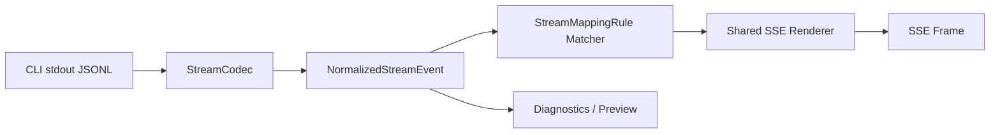

# 流式事件标准化与响应映射设计方案

日期：2026-05-27

适用项目：Proxy2LocalAI

评审修订状态：已根据评审意见补充版本控制落地、安全策略、SSE 渲染契约、事件关联字段、旧配置迁移范围、真实 fixture 测试、donePolicy 和分阶段实施关卡。

## 0. 评审意见处理结论

本次评审意见大部分采纳，并已写入本文：

- 采纳：正式设计文档需要进入 Git 跟踪。已通过 `.gitignore` 放行本文档。
- 采纳：安全策略不能只覆盖 tool 事件。新增 `mappingSecurityPolicy`，覆盖变量白名单、`raw/data` 输出、诊断日志和 UI 预览。
- 采纳：SSE renderer 必须写死契约。新增事件名校验、data 序列化、多行处理、变量缺失和渲染错误策略。
- 采纳：标准事件需要关联字段。新增 `eventId`、`turnId`、`parentId`、`correlationId`、`blockIndex`。
- 采纳：旧配置迁移范围需要覆盖 shared、extension、导入导出和模板应用。
- 采纳：Provider codec 必须用真实脱敏 fixture 做 golden tests。
- 采纳：补齐 `donePolicy` schema。

边界说明：不建议第一阶段把 `responseMode=stream` 也统一改走新标准事件。第一阶段只改 `mapped_sse`，保留当前 OpenAI SSE 路径，降低回归风险。未来如果统一所有流式路径，必须追加 OpenAI SSE 回归测试。

## 1. 背景

当前项目已经支持将浏览器请求代理到本地 Claude Code、Codex CLI 或自定义命令，并提供了基础的响应映射能力：

- `responseMode=stream`：返回 OpenAI 兼容 SSE。
- `responseMode=mapped_sse`：把 provider 事件源 `reasoning/message` 映射到目标 SSE event。
- `responseMode=custom_json`：聚合 AI 输出后套入 JSON 模板。

现有实现的关键位置：

- `packages/shared/src/profile.ts`：`ResponseMode`、`sseEventMappings`、`sseDoneEvent`。
- `packages/shared/src/responseTemplates.ts`：内置响应模板与样例推断。
- `apps/bridge/src/providers.ts`：`streamEvents()`、`ProviderStreamEvent`、Claude/Codex 输出解析。
- `apps/bridge/src/server.ts`：`mappedSseResponse()`。
- `apps/extension/src/options/components/ResponseTemplatePicker.tsx`：模板选择和样例推断 UI。
- `apps/extension/src/options/components/ProfileEditor.tsx`：Profile 编辑入口。

现有设计的问题是：内部流事件只有 `source/content`，无法稳定表达 Claude Code 和 Codex 的消息类型、工具调用、工具参数增量、审批请求、状态、错误和完成事件。用户如果想配置自己的业务流式结构，会被迫理解不同 AI CLI 的原始 JSONL 结构，这不够通用，也不利于后续添加新 provider。

## 2. 设计目标

本设计目标是把现有映射能力升级为三层结构：

```text
Claude Code / Codex / Custom 原始流式输出
  -> Provider Codec 标准化
  -> NormalizedStreamEvent 内部事件
  -> 用户配置的响应映射规则
  -> 目标页面需要的 SSE / JSON 结构
```

具体目标：

1. 支持 Claude Code 与 Codex 的文本、推理、状态、错误、完成和 tool call 类事件。
2. 用户只配置自己的目标返回结构，不直接依赖 Claude/Codex 原始事件结构。
3. 旧的 `sseEventMappings` 配置继续可用，并自动迁移到新规则。
4. 支持后续添加其他 AI 工具，只需要新增 provider codec，不需要重写 bridge 响应逻辑。
5. UI 提供清晰指引、内置模板、可复制示例、目标响应预览。
6. tool call 默认脱敏，用户显式开启后才返回更多工具输入或输出信息。
7. 映射输出必须有确定的 SSE 渲染契约，避免同一配置在不同实现中产生不同响应。
8. 安全策略覆盖 message、reasoning、tool、status、error、raw/debug 和诊断日志，不只覆盖 tool call。

## 3. 非目标

第一阶段不做以下事情：

1. 不支持用户在映射规则中执行 JavaScript。
2. 不做任意复杂编程语言级别的转换逻辑。
3. 不默认暴露完整本地文件路径、命令、文件内容、环境变量或工具输出。
4. 不改变当前 `block` 和 `custom_json` 的主流程。
5. 不要求用户理解 Claude Code 或 Codex 的完整原始 JSONL 协议。
6. 第一阶段不重构 `responseMode=stream` 的 OpenAI SSE 路径；它仍使用当前 `streamText()` 流程。新标准事件优先服务 `responseMode=mapped_sse`。

## 4. 当前方案对比

### 方案 A：继续扩展 `source/content`

做法：继续让 provider 输出 `{ source, content }`，新增 `source=tool`、`source=status`。

优点：

- 改动最小。
- 与当前 `mapped_sse` 兼容。

缺点：

- 无法表达 tool call 的 start/delta/end/result。
- 无法区分 `delta`、`snapshot`、`done`、`error`。
- 后续 provider 越多，`providers.ts` 会继续堆特殊逻辑。

结论：不推荐作为长期方案。

### 方案 B：引入标准事件模型

做法：把 provider 原始输出先标准化为 `NormalizedStreamEvent`，再由映射规则输出目标响应。

优点：

- 能表达消息、推理、工具、错误、完成、状态。
- 用户配置不绑定 Claude/Codex 原始结构。
- 添加新 provider 时只新增 codec。
- 适合做 UI 预览、样例推断、规则测试。

缺点：

- 需要新增 schema、codec、renderer 和兼容迁移。

结论：推荐方案。

### 方案 C：完全让用户写 JSONPath/JQ 映射原始事件

做法：用户直接针对 Claude/Codex JSONL 写路径提取和输出模板。

优点：

- 理论上最灵活。

缺点：

- 用户学习成本高。
- 每个 provider 的原始结构不同，配置不可迁移。
- 安全边界更难控制。

结论：只适合作为未来专家模式，不作为第一阶段主方案。

## 5. 推荐架构



### 5.1 Provider Codec 层

每个 AI 工具对应一个 codec：

- `claude-code-v1`
- `codex-cli-v1`
- `custom-jsonl-v1`

职责：

1. 解析 stdout 的每一行。
2. 识别原始事件类型。
3. 输出一个或多个 `NormalizedStreamEvent`。
4. 维护必要的增量状态，例如 tool input JSON 拼接、snapshot diff、sequence 和 correlationId。

### 5.2 标准事件层

Bridge 内部只消费 `NormalizedStreamEvent`。后续 provider 不再直接输出目标 SSE。

### 5.3 映射层

用户通过 `StreamMappingRule` 配置：

- 匹配哪些标准事件。
- 输出什么 SSE event。
- data 结构如何组装。

映射层只允许安全模板变量，不允许执行代码。

## 6. 标准事件模型

建议在 `packages/shared/src/streamEvents.ts` 新增类型。

```ts
export type StreamEventKind =
  | "lifecycle"
  | "delta"
  | "snapshot"
  | "tool_call_start"
  | "tool_call_delta"
  | "tool_call_end"
  | "tool_result"
  | "tool_approval"
  | "usage"
  | "error"
  | "done"
  | "raw";

export type StreamEventChannel =
  | "message"
  | "reasoning"
  | "tool"
  | "status"
  | "debug";

export interface NormalizedStreamEvent {
  provider: "claude" | "codex" | "custom";
  eventId: string;
  sequence: number;
  turnId?: string;
  parentId?: string;
  correlationId?: string;
  blockIndex?: number;
  kind: StreamEventKind;
  channel: StreamEventChannel;
  role?: "assistant" | "user" | "system" | "tool";
  content?: string;
  data?: unknown;
  raw?: unknown;
  tool?: {
    id?: string;
    name?: string;
    input?: unknown;
    inputDelta?: string;
    output?: unknown;
    status?: "started" | "running" | "completed" | "failed" | "approval_required";
  };
  meta?: {
    sessionId?: string;
    model?: string;
    providerEventType?: string;
    finishReason?: string;
    timestamp?: string;
  };
}
```

设计说明：

- `kind` 表示事件生命周期和语义。
- `channel` 表示用户关心的展示通道。
- `content` 用于文本增量。
- `tool` 用于工具调用结构化信息。
- `raw` 仅用于诊断和专家预览，默认不映射给目标页面。
- `sequence` 由 bridge 统一生成，便于前端排序和调试。
- `eventId` 是每个标准事件的稳定 ID，便于诊断、测试和 UI 预览定位。
- `turnId` 标识一次用户请求或一次 provider turn。
- `parentId` 表示事件父级关系，例如 tool result 关联 tool call start。
- `correlationId` 用于把 tool start、tool input delta、tool end、tool result 串起来。对 tool 类事件，如果 provider 没有提供 tool id，codec 必须生成内部 correlationId。
- `blockIndex` 用于 Claude content block、Codex item 或其他分块输出的局部顺序关联。

## 7. Claude Code Codec

建议文件：`apps/bridge/src/streamCodecs/claudeCode.ts`。

Claude Code 使用 `claude -p --output-format stream-json --include-partial-messages` 时，会输出 JSONL。Codec 应处理以下常见事件：

| Claude 原始事件 | 标准事件 |
| --- | --- |
| `stream_event.event.type=content_block_delta` + `delta.type=text_delta` | `delta/message` |
| `delta.type=thinking_delta` 或 `reasoning_delta` | `delta/reasoning` |
| `content_block_start` + `content_block.type=tool_use` | `tool_call_start/tool` |
| `content_block_delta` + `delta.type=input_json_delta` | `tool_call_delta/tool` |
| `content_block_stop` 且当前 block 是 tool | `tool_call_end/tool` |
| `system`、`init`、`api_retry` | `lifecycle/status` |
| `assistant` partial snapshot | `snapshot/message` 或按策略 diff 为 `delta/message` |
| `result` | `done/message` |
| 无法识别但可诊断的 JSON | `raw/debug` |

Claude tool call 示例输入：

```json
{
  "type": "stream_event",
  "event": {
    "type": "content_block_start",
    "content_block": {
      "type": "tool_use",
      "id": "toolu_123",
      "name": "Read",
      "input": {}
    }
  }
}
```

标准化输出：

```json
{
  "provider": "claude",
  "eventId": "evt_000012",
  "sequence": 12,
  "turnId": "turn_abc",
  "correlationId": "toolu_123",
  "blockIndex": 1,
  "kind": "tool_call_start",
  "channel": "tool",
  "tool": {
    "id": "toolu_123",
    "name": "Read",
    "status": "started"
  },
  "meta": {
    "providerEventType": "content_block_start"
  }
}
```

## 8. Codex Codec

建议文件：`apps/bridge/src/streamCodecs/codexCli.ts`。

Codex CLI 使用 `codex exec --json` 输出 JSONL。不同版本 JSON shape 可能变化，因此 codec 应使用保守策略：优先识别稳定事件名，未知结构保留为 `raw/debug`。

| Codex 原始事件 | 标准事件 |
| --- | --- |
| `msg.type=text` 或等价文本事件 | `delta/message` |
| `exec_approval_request` | `tool_approval/tool` |
| `apply_patch_approval_request` | `tool_approval/tool` |
| shell command start/run 类事件 | `tool_call_start/tool` |
| shell command output 类事件 | `tool_result/tool` |
| `turn_complete` | `done/status` |
| `error` | `error/status` |
| 未知 JSONL | `raw/debug` |

Codex 审批事件标准化示例：

```json
{
  "provider": "codex",
  "eventId": "evt_000008",
  "sequence": 8,
  "turnId": "turn_abc",
  "correlationId": "codex_tool_0001",
  "kind": "tool_approval",
  "channel": "tool",
  "content": "Command approval required",
  "tool": {
    "name": "shell",
    "status": "approval_required"
  },
  "data": {
    "reason": "exec_approval_request"
  },
  "meta": {
    "providerEventType": "exec_approval_request"
  }
}
```

## 9. 映射规则模型

建议在 `packages/shared/src/streamMapping.ts` 新增类型和渲染函数。

```ts
export interface StreamMappingRule {
  id: string;
  enabled: boolean;
  match: {
    kind?: StreamEventKind;
    channel?: StreamEventChannel;
    providerEventType?: string;
    toolName?: string;
    correlationId?: string;
  };
  emit: {
    protocol: "sse";
    event: string;
    data: unknown;
  };
}
```

匹配规则：

- 所有已声明字段都必须匹配。
- 未声明字段表示不限制。
- `toolName` 匹配 `event.tool.name`。
- 第一阶段不提供正则匹配，避免 UI 和校验复杂化。

模板变量：

```text
{{content}}
{{sequence}}
{{eventId}}
{{turnId}}
{{parentId}}
{{correlationId}}
{{blockIndex}}
{{kind}}
{{channel}}
{{role}}
{{data}}
{{tool.id}}
{{tool.name}}
{{tool.inputDelta}}
{{tool.status}}
{{meta.sessionId}}
{{meta.model}}
{{meta.providerEventType}}
{{meta.finishReason}}
```

渲染规则：

1. 如果模板值是字符串且完全等于变量，例如 `"{{content}}"`，则保留原始值类型。
2. 如果模板值是包含变量的字符串，例如 `"delta: {{content}}"`，则输出字符串。
3. 如果变量不存在，默认按 `missingVariablePolicy` 处理，第一阶段默认值为 `empty_string`。
4. `{{data}}`、`{{raw}}` 默认不允许输出到目标页面，除非 `mappingSecurityPolicy` 显式开启。
5. renderer 必须放在 `packages/shared`，作为纯函数实现，Bridge 和 Extension 预览复用同一套逻辑。

### 9.1 SSE 渲染契约

建议在 `packages/shared/src/streamMapping.ts` 中实现：

```ts
export interface RenderStreamMappingOptions {
  missingVariablePolicy: "empty_string" | "drop_frame" | "error";
  rendererErrorPolicy: "drop_frame" | "emit_error" | "throw";
  securityPolicy: MappingSecurityPolicy;
}

export interface RenderedSseFrame {
  event: string;
  data: string;
  frame: string;
}
```

渲染契约必须固定：

1. `emit.event` 必须通过校验：`^[A-Za-z0-9_.:-]{1,80}$`。不允许空值、空白、换行和控制字符。
2. `emit.data` 必须先完成模板变量替换，再统一 `JSON.stringify()` 为 SSE data。
3. 字符串 data 也必须 JSON 序列化，例如内容 `hello` 输出为 `data: "hello"`，避免前端解析歧义。
4. 如果业务明确要求纯文本 SSE，可后续新增 `dataEncoding: "json" | "text"`；第一阶段只支持 `json`。
5. JSON 序列化后的 data 如果包含换行，renderer 必须按 SSE 规范拆成多行 `data:`。
6. 每个 frame 以空行结束：`event: <name>\ndata: <json>\n\n`。
7. 变量不存在时：
   - 默认输出空字符串。
   - 如果规则配置 `missingVariablePolicy=drop_frame`，跳过该帧。
   - 如果配置 `error`，生成 renderer error，并由 `rendererErrorPolicy` 决定是否输出 error event。
8. 对象变量只有在安全策略允许时才能整段嵌入，例如 `{{data}}`、`{{raw}}`、`{{tool.input}}`。
9. 渲染错误不能让整个 provider 进程失控；默认跳过该帧并写诊断，只有专家模式才允许抛出。
10. 必须为 renderer 添加 golden tests，固定输入标准事件、映射规则和最终 SSE 字节输出。

## 10. Profile Schema 扩展

在 `ProxyProfile` 上新增字段：

```ts
export type StreamCodecId =
  | "claude-code-v1"
  | "codex-cli-v1"
  | "custom-jsonl-v1";

export interface StreamDoneEvent {
  event: string;
  data: unknown;
}

export interface ToolEventPolicy {
  enabled: boolean;
  includeInput: "none" | "redacted" | "raw";
  includeOutput: "none" | "summary" | "raw";
  allowToolNames?: string[];
  denyToolNames?: string[];
  redactPaths: boolean;
  redactSecrets: boolean;
}

export interface MappingSecurityPolicy {
  allowedVariables: string[];
  allowRaw: boolean;
  allowData: boolean;
  allowToolInput: boolean;
  allowToolOutput: boolean;
  redactDiagnostics: boolean;
  redactPreview: boolean;
  persistRenderedFrames: boolean;
}

export interface StreamDonePolicy {
  onProviderDone: "emit_completed" | "none";
  onProviderError: "emit_failed" | "none";
  onRendererError: "skip_frame" | "emit_error" | "fail_stream";
  onClientAbort: "none";
}
```

`ProxyProfile` 增加：

```ts
streamCodec?: StreamCodecId;
streamMappings?: StreamMappingRule[];
streamDoneEvent?: StreamDoneEvent;
toolEventPolicy?: ToolEventPolicy;
mappingSecurityPolicy?: MappingSecurityPolicy;
streamDonePolicy?: StreamDonePolicy;
```

默认值：

```ts
streamCodec =
  provider === "claude" ? "claude-code-v1" :
  provider === "codex" ? "codex-cli-v1" :
  "custom-jsonl-v1";

toolEventPolicy = {
  enabled: false,
  includeInput: "redacted",
  includeOutput: "none",
  redactPaths: true,
  redactSecrets: true
};

mappingSecurityPolicy = {
  allowedVariables: [
    "content",
    "sequence",
    "eventId",
    "turnId",
    "parentId",
    "correlationId",
    "blockIndex",
    "kind",
    "channel",
    "role",
    "tool.id",
    "tool.name",
    "tool.inputDelta",
    "tool.status",
    "meta.sessionId",
    "meta.model",
    "meta.providerEventType",
    "meta.finishReason"
  ],
  allowRaw: false,
  allowData: false,
  allowToolInput: false,
  allowToolOutput: false,
  redactDiagnostics: true,
  redactPreview: true,
  persistRenderedFrames: false
};

streamDonePolicy = {
  onProviderDone: "emit_completed",
  onProviderError: "emit_failed",
  onRendererError: "skip_frame",
  onClientAbort: "none"
};
```

## 11. 旧配置兼容

旧配置：

```json
{
  "responseMode": "mapped_sse",
  "sseEventMappings": [
    { "source": "reasoning", "targetEvent": "reasoning" },
    { "source": "message", "targetEvent": "message" }
  ],
  "sseDoneEvent": {
    "targetEvent": "done",
    "data": { "status": "completed" }
  }
}
```

自动迁移为：

```json
{
  "responseMode": "mapped_sse",
  "streamMappings": [
    {
      "id": "legacy-reasoning",
      "enabled": true,
      "match": { "kind": "delta", "channel": "reasoning" },
      "emit": {
        "protocol": "sse",
        "event": "reasoning",
        "data": "{{content}}"
      }
    },
    {
      "id": "legacy-message",
      "enabled": true,
      "match": { "kind": "delta", "channel": "message" },
      "emit": {
        "protocol": "sse",
        "event": "message",
        "data": "{{content}}"
      }
    }
  ],
  "streamDoneEvent": {
    "event": "done",
    "data": { "status": "completed" }
  }
}
```

兼容要求：

- `normalizeProfile` 读取旧 profile 时自动补齐新字段。
- `profileToDraft` 需要把旧字段转换成新 UI draft 字段。
- `draftToProfile` 保存时优先保存新字段，同时保留旧字段 fallback，直到下一个破坏性版本再清理。
- `parseConfigImport` 导入配置时执行旧字段迁移。
- `createConfigExport` 导出配置时包含新字段，并可选择保留旧字段以兼容旧版本。
- `applyResponseTemplateToProfile` 应写入 `streamMappings`、`streamDoneEvent`、`mappingSecurityPolicy` 和 `toolEventPolicy`。
- `sseDoneEvent.targetEvent` 到 `streamDoneEvent.event` 的命名差异必须有单测覆盖。
- UI 可以展示“旧版映射已自动转换”提示。
- Bridge 在没有 `streamMappings` 时仍能读取旧 `sseEventMappings`。

## 12. Bridge 响应流程

`mappedSseResponse()` 调整为：

```text
1. 写入 SSE headers。
2. 根据 profile.streamCodec 选择 codec。
3. provider 输出原始 stdout line。
4. codec 将 line 转成 NormalizedStreamEvent[]。
5. 对每个标准事件：
   5.1 应用 mappingSecurityPolicy 和 toolEventPolicy 脱敏。
   5.2 写入诊断日志。
   5.3 用 streamMappings 匹配。
   5.4 命中后调用 shared renderer 渲染 SSE frame。
   5.5 renderer 失败时按 streamDonePolicy.onRendererError 处理。
6. Provider 正常结束后按 streamDonePolicy.onProviderDone 输出 completed done event。
7. Provider 出错时输出 error event，再按 streamDonePolicy.onProviderError 输出 failed done event。
8. 客户端断开时按 streamDonePolicy.onClientAbort 处理，第一阶段不再追加 done。
```

建议把现有 `provider.streamEvents()` 演进为：

```ts
streamEvents(
  profile: ProxyProfile,
  prompt: string,
  context?: ProviderRunContext
): AsyncIterable<NormalizedStreamEvent>;
```

第一阶段也可以保留 fallback：

```ts
if provider only supports streamText:
  streamText chunk -> delta/message
```

`responseMode=stream` 兼容边界：

- 第一阶段不修改当前 OpenAI SSE 路径，仍保留 `provider.streamText()` -> `createStreamChunk()` -> `[DONE]`。
- 新 codec 和 renderer 只接入 `responseMode=mapped_sse`。
- 如果未来要让 `responseMode=stream` 也走 `NormalizedStreamEvent`，必须新增 OpenAI SSE 回归测试，覆盖 chunk shape、`[DONE]`、错误帧、proxy_status 和现有调用方兼容性。

## 13. 内置响应模板

在 `BUILTIN_RESPONSE_TEMPLATES` 中增加面向用户的模板。

### 13.1 通用聊天 SSE

适合只需要回答文本的业务。

输出：

```text
event: message
data: {"content":"你好"}

event: done
data: {"status":"completed"}
```

配置：

```json
{
  "id": "generic_chat_sse",
  "responseMode": "mapped_sse",
  "streamMappings": [
    {
      "id": "message",
      "enabled": true,
      "match": { "kind": "delta", "channel": "message" },
      "emit": {
        "protocol": "sse",
        "event": "message",
        "data": { "content": "{{content}}" }
      }
    }
  ],
  "streamDoneEvent": {
    "event": "done",
    "data": { "status": "completed" }
  }
}
```

### 13.2 带推理过程 SSE

适合需要区分 reasoning 与最终回答的业务。

```json
{
  "id": "chat_reasoning_sse",
  "responseMode": "mapped_sse",
  "streamMappings": [
    {
      "id": "reasoning",
      "enabled": true,
      "match": { "kind": "delta", "channel": "reasoning" },
      "emit": {
        "protocol": "sse",
        "event": "reasoning",
        "data": { "delta": "{{content}}" }
      }
    },
    {
      "id": "message",
      "enabled": true,
      "match": { "kind": "delta", "channel": "message" },
      "emit": {
        "protocol": "sse",
        "event": "message",
        "data": { "delta": "{{content}}" }
      }
    }
  ]
}
```

### 13.3 工具状态 SSE

适合目标页面想展示“正在读文件、正在执行命令、工具完成”的场景。

```json
{
  "id": "tool_status_sse",
  "responseMode": "mapped_sse",
  "toolEventPolicy": {
    "enabled": true,
    "includeInput": "redacted",
    "includeOutput": "none",
    "redactPaths": true,
    "redactSecrets": true
  },
  "streamMappings": [
    {
      "id": "tool-start",
      "enabled": true,
      "match": { "kind": "tool_call_start", "channel": "tool" },
      "emit": {
        "protocol": "sse",
        "event": "tool",
        "data": {
          "type": "tool.start",
          "toolName": "{{tool.name}}",
          "toolId": "{{tool.id}}"
        }
      }
    },
    {
      "id": "tool-delta",
      "enabled": true,
      "match": { "kind": "tool_call_delta", "channel": "tool" },
      "emit": {
        "protocol": "sse",
        "event": "tool",
        "data": {
          "type": "tool.input.delta",
          "toolName": "{{tool.name}}",
          "delta": "{{tool.inputDelta}}"
        }
      }
    },
    {
      "id": "tool-end",
      "enabled": true,
      "match": { "kind": "tool_call_end", "channel": "tool" },
      "emit": {
        "protocol": "sse",
        "event": "tool",
        "data": {
          "type": "tool.end",
          "toolName": "{{tool.name}}",
          "status": "{{tool.status}}"
        }
      }
    }
  ]
}
```

### 13.4 业务流式 SSE

适合目标系统要求 `code/data/message` 包裹。

```json
{
  "id": "business_stream_sse",
  "responseMode": "mapped_sse",
  "streamMappings": [
    {
      "id": "chat",
      "enabled": true,
      "match": { "kind": "delta", "channel": "message" },
      "emit": {
        "protocol": "sse",
        "event": "chat",
        "data": {
          "code": 0,
          "data": {
            "type": "answer.delta",
            "content": "{{content}}"
          },
          "message": "ok"
        }
      }
    },
    {
      "id": "error",
      "enabled": true,
      "match": { "kind": "error" },
      "emit": {
        "protocol": "sse",
        "event": "error",
        "data": {
          "code": 500,
          "data": null,
          "message": "{{content}}"
        }
      }
    }
  ],
  "streamDoneEvent": {
    "event": "finish",
    "data": {
      "code": 0,
      "data": { "status": "completed" },
      "message": "done"
    }
  }
}
```

## 14. UI 设计

### 14.1 信息架构

将当前“返回模板”区域升级为“响应映射”。

建议分为四块：

1. 模板选择
2. 标准事件说明
3. 映射规则编辑
4. 样例推断与预览

### 14.2 用户指引文案

放在响应映射顶部：

```text
你只需要配置目标页面期望收到的响应结构。
Proxy2LocalAI 会先把 Claude Code / Codex 的复杂流式事件转换成统一事件：
message、reasoning、tool、status、error、done。
然后再按照这里的映射规则输出为 SSE。
```

### 14.3 标准事件说明

以折叠面板展示：

| 标准通道 | 含义 | 默认是否返回 |
| --- | --- | --- |
| `message` | AI 最终回答文本增量 | 是 |
| `reasoning` | 推理或思考文本增量 | 否，用户可启用 |
| `tool` | 工具调用、审批、工具结果 | 否，用户可启用 |
| `status` | provider 生命周期状态 | 否，仅诊断默认显示 |
| `error` | 错误事件 | 是 |
| `done` | 流结束事件 | 是 |

### 14.4 普通模式规则编辑

用表单编辑常见字段：

- 当标准事件为：`message/reasoning/tool/error`
- SSE event 名称
- data JSON 模板
- 是否启用

示例：

```json
{
  "type": "answer.delta",
  "content": "{{content}}"
}
```

### 14.5 专家模式规则编辑

提供完整 JSON textarea，但需要：

- 保存前校验 JSON。
- 展示可用变量列表。
- 展示渲染预览。
- 对危险变量 `{{raw}}`、`{{data}}` 给出风险提示。

### 14.6 样例推断

用户粘贴目标响应样例：

```text
event: chat
data: {"type":"answer.delta","content":"你好"}

event: finish
data: {"type":"done","status":"completed"}
```

系统推断：

```json
{
  "message event": "chat",
  "content path": "data.content",
  "done event": "finish"
}
```

第一阶段推断可以保守，只做：

- 提取 SSE event 名。
- 如果 data JSON 中存在明显文本字段 `content/text/delta/message`，替换为 `{{content}}`。
- 如果有 `done/finish/complete`，作为 `streamDoneEvent`。

### 14.7 预览区

用内置模拟事件生成最终输出：

输入标准事件：

```json
{
  "kind": "delta",
  "channel": "message",
  "content": "你好"
}
```

预览输出：

```text
event: chat
data: {"type":"answer.delta","content":"你好"}
```

## 15. 安全与脱敏

流式事件中的多个通道都可能包含敏感信息，不只 tool call：

- 本地路径
- shell 命令
- 文件内容
- 环境变量
- 错误堆栈
- 代码片段
- token 或密钥
- provider stderr
- raw/debug 事件
- status/error 事件中的上下文

默认策略：

```json
{
  "mappingSecurityPolicy": {
    "allowRaw": false,
    "allowData": false,
    "allowToolInput": false,
    "allowToolOutput": false,
    "redactDiagnostics": true,
    "redactPreview": true,
    "persistRenderedFrames": false
  },
  "toolEventPolicy": {
    "enabled": false,
    "includeInput": "redacted",
    "includeOutput": "none",
    "redactPaths": true,
    "redactSecrets": true
  }
}
```

规则：

1. 未开启 `toolEventPolicy.enabled` 时，不向目标页面输出 tool 事件。
2. `includeInput=redacted` 时，隐藏路径、密钥和长文本。
3. `includeOutput=summary` 时，只输出长度、状态和简短摘要。
4. `includeInput=raw` 或 `includeOutput=raw` 必须放在专家配置中，并显示二次确认。
5. `{{raw}}`、`{{data}}`、`{{tool.input}}`、`{{tool.output}}` 默认不能渲染到目标页面。
6. error/status/debug 事件进入映射前也必须执行脱敏。
7. 诊断日志默认只记录事件类型、长度、阶段和脱敏摘要，不落完整渲染帧。
8. UI 预览默认使用模拟事件；如果使用真实 provider 输出预览，必须走脱敏并标识“已脱敏”。

## 16. 测试计划

### 16.1 Shared 单测

新增：

- `streamEvents.test.ts`
- `streamMapping.test.ts`
- `streamMappingMigration.test.ts`

覆盖：

- 标准事件 schema 校验。
- 模板变量渲染。
- 旧 `sseEventMappings` 迁移。
- `streamDoneEvent` 默认值。
- 危险变量禁用。
- toolEventPolicy 默认值。
- mappingSecurityPolicy 默认值。
- SSE event 名校验。
- 多行 data 拆分。
- 对象变量嵌入。
- renderer error policy。
- `sseDoneEvent.targetEvent` -> `streamDoneEvent.event` 迁移。

### 16.2 Bridge 单测

新增或扩展：

- `providers.test.ts`
- `server.test.ts`
- `streamCodecs/claudeCode.test.ts`
- `streamCodecs/codexCli.test.ts`

覆盖：

- Claude `text_delta` -> `delta/message`。
- Claude `thinking_delta` -> `delta/reasoning`。
- Claude `tool_use` start/delta/end。
- Codex `text` -> `delta/message`。
- Codex `exec_approval_request` -> `tool_approval/tool`。
- Codex `turn_complete` -> `done/status`。
- provider error -> error SSE。
- mapped_sse 输出是否符合配置。
- 使用脱敏真实 JSONL fixture 做 golden tests。

Fixture 建议目录：

```text
apps/bridge/src/streamCodecs/__fixtures__/
  claude-text-delta.jsonl
  claude-reasoning-tool-use.jsonl
  claude-result-error.jsonl
  codex-text-turn-complete.jsonl
  codex-exec-approval.jsonl
  codex-error.jsonl
```

Fixture 要求：

- 只能提交脱敏样本。
- 不包含真实路径、token、用户名、私有代码或完整命令输出。
- 每个 fixture 对应一份 expected normalized events JSON。

### 16.3 Extension 单测

覆盖：

- 内置模板卡片展示。
- 模板选择后写入 `streamMappings`。
- 样例推断结果。
- 专家 JSON 编辑校验。
- tool 事件风险提示显示。

### 16.4 手动验收

1. 配置 Claude Code profile。
2. 选择“通用聊天 SSE”模板。
3. 请求目标接口，确认输出 `event: message`。
4. 切换“带推理过程 SSE”模板，确认 reasoning 映射可用。
5. 开启 tool 状态模板，确认 tool start/end 可见且默认脱敏。
6. 配置 Codex profile，确认文本、审批、完成事件可标准化。
7. 旧配置 `reasoning=reasoning/message=message` 仍然可用。

## 17. 实施关卡

### 关卡一：文档与版本控制落地

1. 确认本文档可被 Git 跟踪。
2. 若后续新增正式设计文档，要么放到 `docs/design/`，要么在 `.gitignore` 中为具体文件放行。
3. 设计进入实现前，必须先完成评审中 P1 项的补充。

### 关卡二：Shared 纯函数

1. 在 `packages/shared` 新增 `streamEvents.ts`。
2. 在 `packages/shared` 新增 `streamMapping.ts`。
3. 实现 renderer、安全策略、事件名校验、变量替换和 SSE frame 序列化。
4. 实现旧配置迁移函数。
5. 扩展 `ProxyProfile`，新增 `streamCodec`、`streamMappings`、`streamDoneEvent`、`streamDonePolicy`、`mappingSecurityPolicy`、`toolEventPolicy`。
6. 添加 shared 单测和 golden tests。

### 关卡三：Bridge 接入

1. 新增 `apps/bridge/src/streamCodecs/claudeCode.ts`。
2. 新增 `apps/bridge/src/streamCodecs/codexCli.ts`。
3. 新增脱敏真实 JSONL fixture。
4. 修改 `providers.ts`，让 `streamEvents()` 输出 `NormalizedStreamEvent`。
5. 修改 `mappedSseResponse()`，使用 shared renderer 渲染 SSE。
6. 保留旧配置 fallback。
7. 第一阶段不修改 `responseMode=stream`。
8. 添加 bridge 单测和 fixture golden tests。

### 关卡四：UI 与文档

1. 扩展 `ResponseTemplate`，支持 `streamMappings`、`streamCodec`、`mappingSecurityPolicy`、`toolEventPolicy`。
2. 新增内置模板。
3. 将“返回模板”改为“响应映射”。
4. 普通用户优先使用模板和表单编辑 event/data。
5. 专家 JSON 编辑器后置，`raw/data/tool raw` 必须二次确认。
6. 增加标准事件说明区、样例推断和预览区。
7. 更新 `README.md` 的“响应映射”说明。
8. 更新 `SECURITY.md` 或 `PRIVACY.md`，说明流式映射和 tool call 脱敏策略。
9. 运行 `npm test`、`npm run typecheck`、`npm run build`。

## 18. 验收标准

功能验收：

- 用户可以通过 UI 选择内置映射模板。
- 用户可以配置自己的 SSE event 名和 data JSON 结构。
- Claude Code 文本、推理、tool call start/delta/end 可以标准化。
- Codex 文本、审批请求、完成、错误可以标准化。
- 旧 `mapped_sse` 配置继续可用。
- tool call 默认不输出敏感参数。
- error/status/raw/debug 不会绕过 `mappingSecurityPolicy`。
- `responseMode=stream` 的 OpenAI SSE 行为不因本次第一阶段改造发生变化。

体验验收：

- 用户不需要阅读 Claude/Codex 原始 JSONL 也能完成配置。
- UI 至少提供 4 个可复制示例。
- UI 能预览最终 SSE 输出。
- 错误提示能说明是 codec、规则匹配、模板渲染还是 provider 失败。

工程验收：

- 新增类型位于 `packages/shared`，不依赖 Node 或 Chrome API。
- Provider 特殊逻辑集中在 codec 文件，不继续堆在 `server.ts`。
- 映射渲染逻辑有单测。
- 旧字段迁移有单测。
- renderer 有 golden tests，固定 SSE 字节输出。
- codec 有真实脱敏 fixture golden tests。
- 构建、类型检查和测试通过。

## 19. 对后续 AI 开发者的执行提示

实现时请遵守以下约束：

1. 不要一次性重写 UI 或 provider 层。
2. 先实现标准事件和映射渲染，再接 Claude/Codex codec。
3. 旧配置必须兼容，不能让已有用户配置失效。
4. tool call 默认脱敏，除非用户显式开启。
5. 不要在第一阶段重构 `responseMode=stream`，除非同时补齐 OpenAI SSE 回归测试。
6. 每个阶段都要有测试，尤其是旧配置迁移、SSE 输出格式、安全策略和 codec fixture。
7. 修改 UI 时保持开发者工具风格，避免做成营销页。
