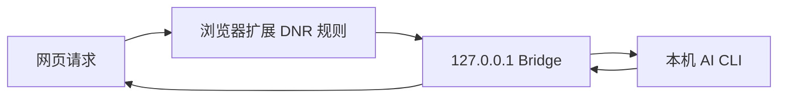

# 安全模型

Proxy2LocalAI 的安全目标不是提供通用网络代理，而是让用户把少量、明确配置过的 API 请求转交给本机 AI CLI。

## 信任边界



- 网页只应该命中用户启用的 profile。
- 扩展只负责把匹配请求重定向到本机 Bridge。
- Bridge 负责 token 鉴权、请求体限制、日志和 Provider 调用。
- Provider 是本机命令，安全性取决于用户安装的 CLI、工作目录和命令参数。

## 关键防护

- Bridge 绑定 `127.0.0.1`，不暴露局域网服务。
- 管理接口和代理入口都需要 token。
- 日志过滤常见敏感请求头。
- profile ID 限制为字母、数字、下划线和短横线。
- 配置导入会经过 schema 归一化和校验。
- Claude/Codex 的危险自动化参数默认关闭。

## 需要用户理解的风险

- 默认 token 只适合本机开发和快速体验，长期使用请设置 `PROXY2LOCALAI_TOKEN`。
- DNR 重定向需要把 token 放入本地 Bridge 查询参数，避免把 Bridge 地址暴露给不可信页面脚本。
- 如果启用 `PROXY2LOCALAI_ALLOW_DANGEROUS_CLI=true`，Claude/Codex 可能在项目目录中执行更高权限的自动化操作。
- Custom Provider 会执行用户填写的本机命令，请只使用可信命令和参数。

## 推荐配置

```powershell
$env:PROXY2LOCALAI_TOKEN="生成一个足够长的随机字符串"
$env:PROXY2LOCALAI_PORT="39399"
npm run start:bridge
```

只有在明确需要无人值守 CLI 自动化时才开启：

```powershell
$env:PROXY2LOCALAI_ALLOW_DANGEROUS_CLI="true"
```
